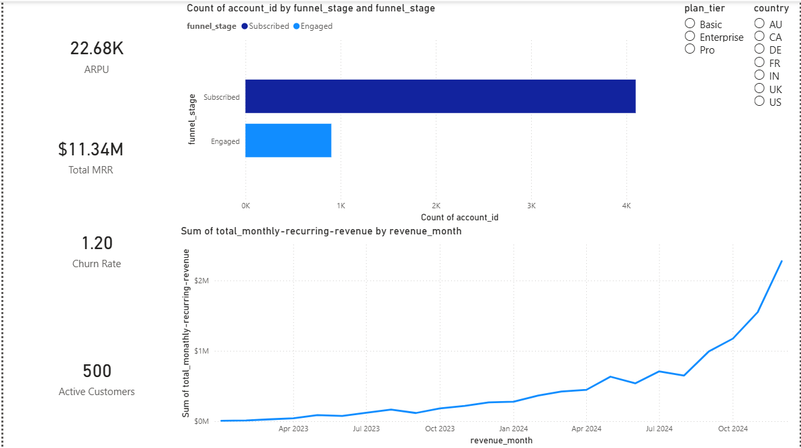
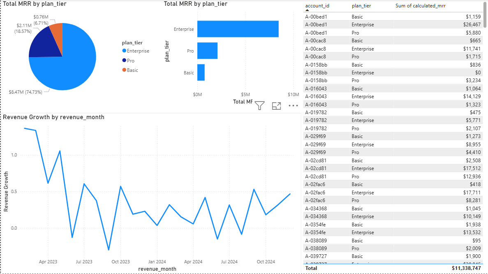
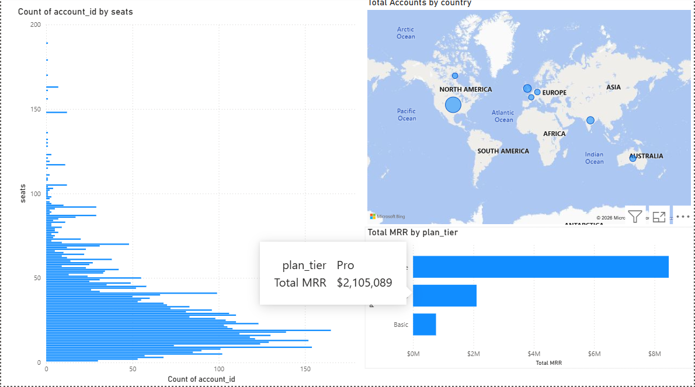
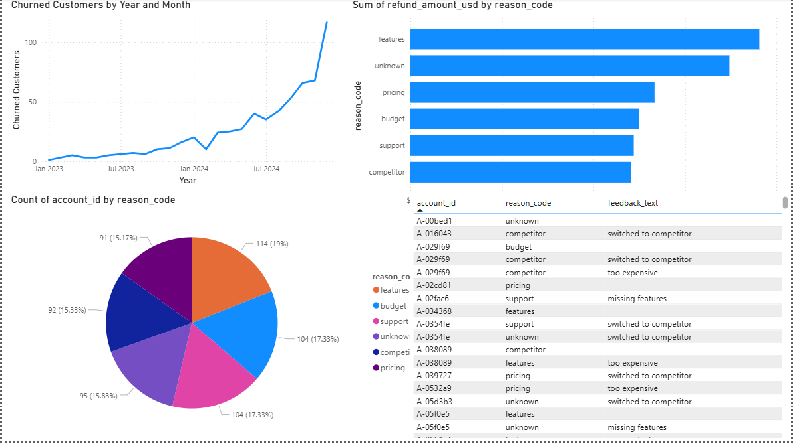

# 🚀 SaaS Funnel & Revenue Analytics (dbt + Power BI)

## 📊 Project Overview

This project demonstrates an end-to-end analytics pipeline for a SaaS business, covering data cleaning, transformation, modeling, and visualization.

The goal was to simulate a real-world analytics workflow and generate actionable insights around revenue, customer behavior, funnel conversion, and churn.

---

## 🧱 Tech Stack

* **Python (Pandas)** → Data cleaning & preprocessing
* **PostgreSQL** → Data warehouse
* **dbt (Data Build Tool)** → Data transformation & modeling
* **Power BI** → Dashboard & visualization

---

## 📂 Data Model

### 🟦 Dimension Tables

* `dim_accounts` → customer details (country, plan, signup date)
* `dim_time` → date-based analysis

### 🟩 Fact Tables

* `fct_subscriptions` → subscription & MRR data
* `fct_revenue` → monthly revenue trends
* `fct_churn` → churn events & reasons
* `fct_funnel` → customer journey stages

---

## 📈 Key Metrics

* 💰 Monthly Recurring Revenue (MRR)
* 📉 Revenue Growth (%)
* 👥 Active Customers
* 💡 ARPU (Average Revenue Per User)
* 🔄 Funnel Conversion Rate
* ⚠️ Churn Rate

---

## 📸 Dashboard Preview

### 🟦 Executive Overview



---

### 📈 Revenue Analysis



---

### 👥 Customer Insights



---

### 📉 Churn Analysis



---

## 🔍 Key Insights

* Revenue shows an overall upward trend, while growth rate fluctuates month-over-month
* Majority of revenue is driven by higher-tier subscription plans
* Funnel analysis highlights drop-offs before conversion to paid subscriptions
* Churn remains within typical SaaS benchmarks (~1–3%) but varies by segment

---

## 🧠 What I Learned

* Built a complete ELT pipeline using dbt and PostgreSQL
* Designed a star schema with proper fact and dimension relationships
* Implemented business KPIs using DAX in Power BI
* Debugged real-world data issues (joins, null values, aggregation errors)
* Translated raw data into meaningful business insights

---

## ⚙️ How to Run

1. Clone the repository
2. Set up PostgreSQL database
3. Run dbt models:

   ```bash
   dbt run --full-refresh
   ```
4. Open Power BI file and connect to PostgreSQL
5. Refresh data

---

## 🎯 Project Purpose

This project was built to simulate a real-world **Analytics Engineering workflow**, combining:

* Data engineering (cleaning + modeling)
* Analytics (KPIs + insights)
* Business intelligence (dashboard storytelling)

---

## 📬 Let’s Connect

If you’re working on data analytics, BI, or analytics engineering — feel free to connect or share feedback!

---

# ⭐ If you found this useful, consider giving it a star!
